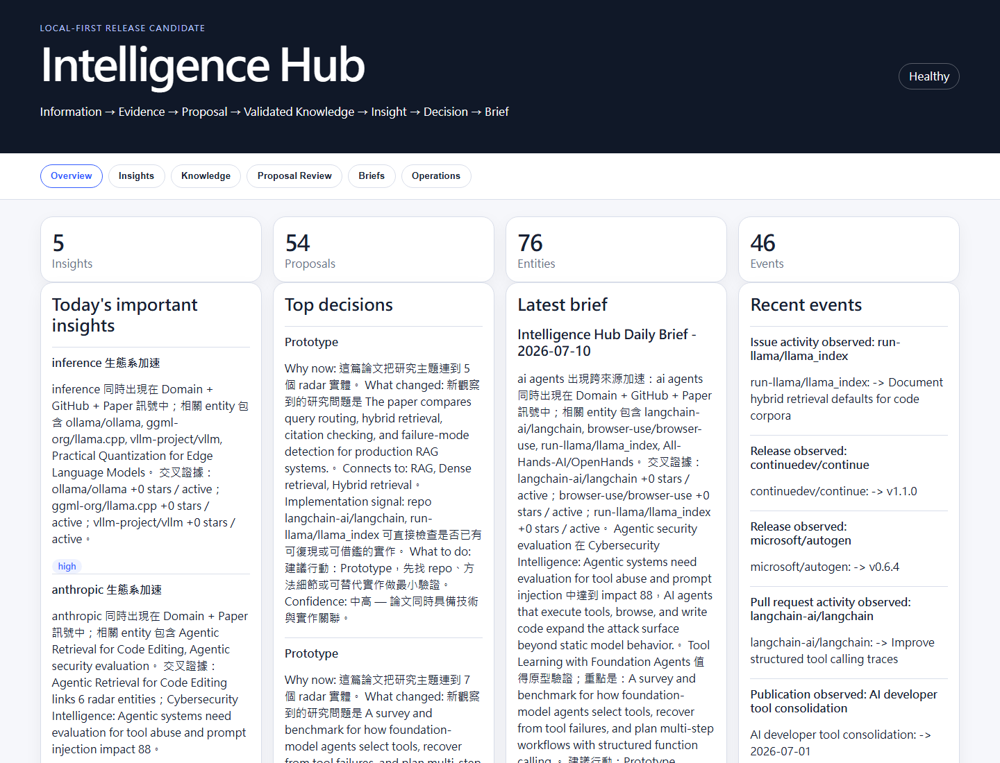
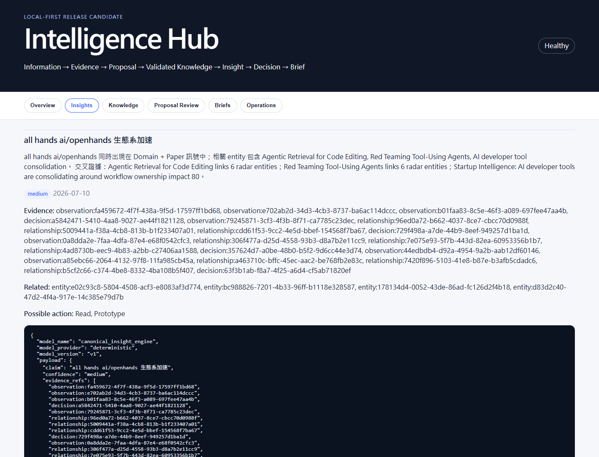
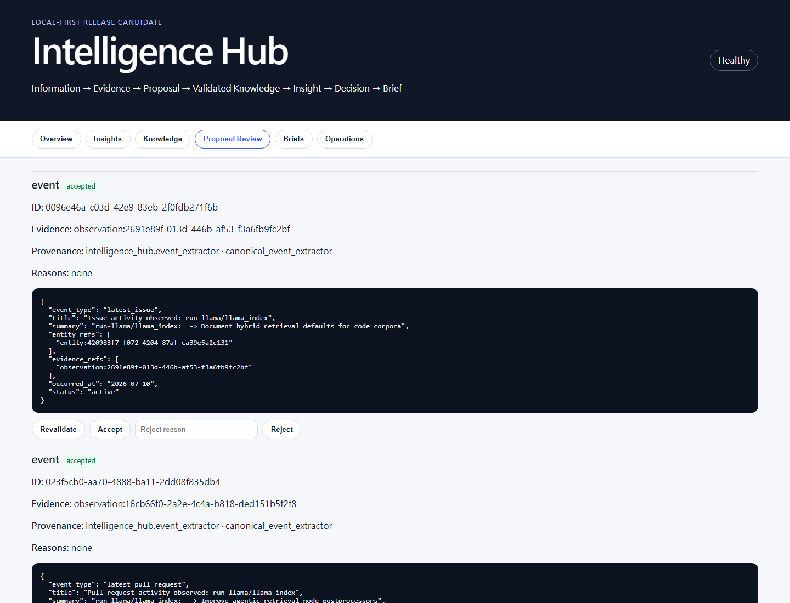

# Intelligence Hub

[](https://github.com/Ian2073/Intelligence-Hub/actions/workflows/ci.yml)
[](https://www.python.org/downloads/release/python-3110/)
[](LICENSE)
[](https://github.com/Ian2073/Intelligence-Hub/releases)

**Local-first decision intelligence for turning fragmented technical signals into evidence-backed knowledge, insights, and actions.**

If you track dozens of repositories, papers, and RSS feeds, the hard problem is not collecting more links. It is deciding what changed, what evidence supports it, what connects across sources, and whether the signal deserves a `Watch`, `Read`, `Prototype`, or `Implement` decision.

Intelligence Hub preserves source evidence first. Model, agent, and extraction output becomes a proposal and must pass validation before it can enter canonical knowledge.

```text
Information → Evidence → Proposal → Validated Knowledge → Insight → Decision → Actionable Brief
```

It is not a news summarizer, a generic RAG demo, or an autonomous agent loop.



_Zero-secret Dashboard overview generated from the deterministic fixture repository._

## Why It Is Different

- **Proposal Trust Layer** prevents unvalidated AI output from directly contaminating canonical knowledge.
- **Canonical SQLite repository** stores entities, observations, relationships, events, insights, decisions, briefs, proposals, and run metrics.
- **Evidence-backed decisions** turn signals into explicit action postures instead of producing another unread summary.
- **Obsidian Knowledge Workspace** uses stable note identities and semantic WikiLinks without requiring Dataview.
- **Zero-secret demo** runs with deterministic fixtures, SQLite, FastAPI, and no external service.
- **Local-first review surfaces** include a Dashboard, API, proposal review, and a rebuildable Obsidian Vault.

See the reproducible [Proposal Trust Layer walkthrough](docs/proposal-trust-layer.md).

## Five-Minute Quickstart

Supported version: **Python 3.11**.

Windows PowerShell:

```powershell
git clone https://github.com/Ian2073/Intelligence-Hub.git
cd Intelligence-Hub
python -m venv hub_env
.\hub_env\Scripts\python.exe -m pip install -e .
Copy-Item .env.example .env
.\hub_env\Scripts\intelligence-hub.exe seed-demo
.\hub_env\Scripts\intelligence-hub.exe serve --seed-demo
```

Linux/macOS:

```bash
git clone https://github.com/Ian2073/Intelligence-Hub.git
cd Intelligence-Hub
python3.11 -m venv hub_env
source hub_env/bin/activate
python -m pip install -e .
cp .env.example .env
intelligence-hub seed-demo
intelligence-hub serve --seed-demo
```

Open:

- Dashboard: <http://127.0.0.1:8000/>
- OpenAPI: <http://127.0.0.1:8000/docs>
- Obsidian Vault: `data/demo/obsidian_vault/`

The demo requires no API key, network collector, Notion workspace, Telegram bot, PostgreSQL, or Hermes installation.

## Thirty-Second Scenario

1. Fixture collectors load related repository, paper, article, company, and technology signals.
2. Deterministic normalization preserves source evidence in SQLite.
3. Non-deterministic extraction and synthesis output enters the Proposal Store.
4. Schema, evidence, confidence, provenance, and conflict validators classify proposals as `accepted`, `rejected`, or `needs_review`.
5. Only accepted proposals become canonical entities, events, relationships, or insights.
6. Decision policy produces explicit actions, and the daily brief links back to its evidence and accepted insights.

## Main CLI

```bash
intelligence-hub --version
intelligence-hub demo
intelligence-hub seed-demo
intelligence-hub serve --seed-demo
intelligence-hub status
intelligence-hub proposals --status rejected
intelligence-hub export-obsidian
```

`scripts/intelligence_hub.py` remains a compatibility wrapper over the same CLI implementation.

## Dashboard

The local single-user Dashboard includes:

- **Overview**: important insights, decisions, latest brief, events, proposal metrics, and runtime status.
- **Insights**: claim, evidence, confidence, related entities/events, possible action, and provenance.
- **Knowledge**: entities, relationships, observations, timelines, sources, insights, and decisions.
- **Proposal Review**: accepted, rejected, and needs-review proposals with validation reasons and review actions.
- **Briefs**: daily, weekly, and monthly intelligence records.
- **Operations**: runtime runs, collector/delivery status, readiness warnings, and Obsidian export health.



_Accepted insights retain confidence, evidence references, related knowledge, possible actions, and provenance._



_Proposal Review exposes validation status, evidence, provenance, reasons, and explicit review actions._

## Obsidian Knowledge Workspace

SQLite remains the system of record. Obsidian is a human-readable projection that can be rebuilt from the canonical repository:

```text
Canonical Repository
  → ObsidianReadModelBuilder
  → ObsidianRenderer
  → ObsidianPublisher
```

Generated notes use stable canonical IDs, collision-safe filenames, semantic WikiLinks, atomic writes, preserved User Notes, and stale-note manifests.

## API

FastAPI serves typed platform-neutral routes, including:

- `/health`, `/ready`
- `/api/briefs`, `/api/insights`, `/api/entities`, `/api/events`, `/api/decisions`
- `/api/proposals` and proposal review actions
- `/api/runtime/runs`, `/api/runtime/status`

Proposal acceptance through the API cannot bypass schema, evidence, and provenance validation.

## Intelligence Hub and Hermes

Intelligence Hub owns canonical persistence, proposal validation, insight generation, decision policy, API, Dashboard, model routing, delivery, and Obsidian projection.

Hermes is an optional research-agent integration and legacy compatibility layer. It may submit proposals through the trust boundary, but it does not own or directly write canonical knowledge.

Existing `python -m hermes` commands remain available for compatibility and are not the primary public interface.

## Configured Mode

Configured mode can enable live GitHub/RSS/paper collectors, model providers, Notion, Telegram, and optional Hermes integration. Missing external settings degrade clearly; they are not required by demo mode.

Use platform-neutral `INTELLIGENCE_HUB_*` variables for new configuration. Legacy `HERMES_*` aliases remain supported where documented.

## Repository Layout

- `core/`: runtime, repository, proposal gate, insight engine, API, Dashboard services, and Obsidian projection.
- `connectors/`: external source and delivery adapters.
- `workflows/`: daily, weekly, monthly, dashboard, radar, and decision-review workflows.
- `dashboard/`: dependency-free local Dashboard assets.
- `data/fixtures/`: deterministic zero-secret demo inputs.
- `tests/`: regression, boundary, repository, trust-layer, projection, CLI, and release tests.
- `scripts/`: operational and legacy compatibility entrypoints; see `scripts/README.md`.
- `docs/`: architecture, configuration, operations, roadmap, and design rationale.

## Development

```bash
python -m pip install -e ".[test]"
ruff check .
python -m pytest tests -q
python -m compileall contracts core connectors hermes workflows scripts main.py
python scripts/smoke_test.py
python scripts/acceptance_check.py
python scripts/first_run_check.py
python scripts/pre_publish_audit.py
```

See [CONTRIBUTING.md](CONTRIBUTING.md).

## Roadmap Boundaries

Implemented: local SQLite repository, Proposal Trust Layer, canonical events/insights, Dashboard/API, Obsidian projection, zero-secret demo, optional configured publishers, and Hermes compatibility.

Not implemented: PostgreSQL, authentication, multi-user SaaS, Kubernetes, causal graph reasoning, full WorldState, multi-agent debate, or a public writable hosted demo.

See [docs/ROADMAP.md](docs/ROADMAP.md) and [docs/IMPLEMENTATION_STATUS.md](docs/IMPLEMENTATION_STATUS.md).

## Security and Privacy

- Demo data is synthetic and fixture-based.
- Secrets belong in ignored `.env` files and are never required for demo mode.
- SQLite demo paths and generated Vaults are ignored.
- Reset only operates on the managed `data/demo/` path and requires explicit confirmation.
- Proposal payloads are summarized in UI error surfaces rather than dumped into unhandled tracebacks.

Report security concerns using [.github/SECURITY.md](.github/SECURITY.md).

## License

MIT License. See [LICENSE](LICENSE).

[繁體中文](README.zh-TW.md)
