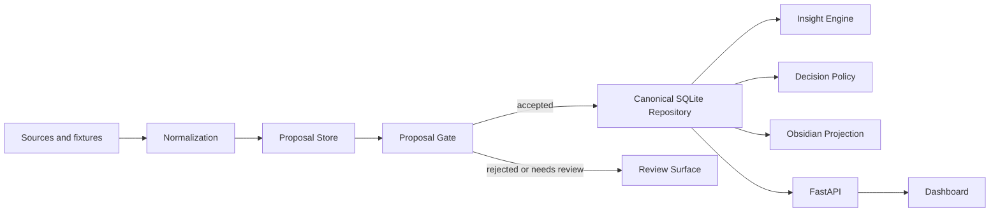

# Intelligence Hub

Local-first decision intelligence: Intelligence Hub turns information into evidence-backed knowledge, insights, decisions, briefs, and an Obsidian knowledge workspace.

It is not a news summarizer, a generic RAG demo, or an autonomous agent loop. The core workflow is:

```text
Information → Evidence → Proposal → Validated Knowledge → Insight → Decision → Actionable Brief
```

Hermes is an optional research-agent integration and legacy compatibility entrypoint. The core platform owns canonical persistence, proposal validation, the Insight Engine, API, Dashboard, and Obsidian projection.

## What It Solves

Technical teams and individual builders often track repositories, papers, articles, and ecosystem shifts as disconnected links. Intelligence Hub converts those signals into a durable SQLite-backed knowledge repository with explicit evidence, confidence, provenance, decisions, and human-readable projections.

## What Makes It Different

- **Proposal Trust Layer**: model, agent, and extraction output becomes a proposal before it can become canonical knowledge.
- **Canonical repository**: SQLite is the default system of record for entities, observations, relationships, events, insights, decisions, briefs, and proposal review.
- **Decision-first output**: important signals are ranked into actions such as `Watch`, `Read`, `Prototype`, `Implement`, or `Review later`.
- **Obsidian Knowledge Workspace**: generated notes use stable IDs and semantic WikiLinks, not plugin-dependent Dataview queries.
- **Zero-secret demo**: fixture data runs without OpenAI, Notion, Telegram, GitHub credentials, PostgreSQL, or Hermes installation.

## Five-Minute Quickstart

Supported Python version: **Python 3.11**. This is the version exercised by CI.

Windows PowerShell:

```powershell
python -m venv hub_env
.\hub_env\Scripts\python.exe -m pip install -r requirements.txt
Copy-Item .env.example .env
.\hub_env\Scripts\python.exe scripts\intelligence_hub.py seed-demo
.\hub_env\Scripts\python.exe scripts\intelligence_hub.py serve --seed-demo
```

Then open:

- Dashboard: <http://127.0.0.1:8000/>
- API docs: <http://127.0.0.1:8000/docs>
- Obsidian vault: `data/demo/obsidian_vault/`

Linux/macOS:

```bash
python3 -m venv hub_env
source hub_env/bin/activate
python -m pip install -r requirements.txt
cp .env.example .env
python scripts/intelligence_hub.py seed-demo
python scripts/intelligence_hub.py serve --seed-demo
```

## Demo Mode

The zero-secret demo uses:

- fixture GitHub repository snapshots
- fixture papers/articles and domain signals
- SQLite at `data/demo/intelligence_hub_demo.sqlite`
- generated Obsidian vault at `data/demo/obsidian_vault/`
- FastAPI plus a static local dashboard

Useful commands:

```powershell
.\hub_env\Scripts\python.exe scripts\intelligence_hub.py demo
.\hub_env\Scripts\python.exe scripts\intelligence_hub.py status
.\hub_env\Scripts\python.exe scripts\intelligence_hub.py proposals --status rejected
.\hub_env\Scripts\python.exe scripts\intelligence_hub.py export-obsidian
```

The seed is repeatable and does not create duplicate demo records on repeated runs.

## Configured Mode

Configured mode can add live collectors, model providers, Notion, Telegram, and optional Hermes integration. Missing external settings degrade to fixture or dry-run behavior where supported; demo mode does not need secrets.

Copy `.env.example` to `.env`, then configure only the integrations you intend to use. Platform-neutral `INTELLIGENCE_HUB_*` names are preferred for new setups; existing `HERMES_*` names remain supported for compatibility.

## Dashboard

The local dashboard includes:

- Overview: important insights, decisions, latest brief, events, proposal metrics, and runtime status
- Insights: claim, confidence, evidence, related entities/events, possible action, and provenance
- Knowledge: entities, relationships, observations, events, insights, and decisions
- Proposal Review: accepted, rejected, and needs-review proposals with revalidate/accept/reject actions
- Briefs: daily/weekly/monthly-friendly Markdown rendering
- Operations: runs, delivery state, readiness warnings, and Obsidian export diagnostics

No CDN or authentication is required. This release candidate is local-first and single-user.

## API

FastAPI serves the dashboard and API:

- `GET /health`, `GET /ready`
- `GET /api/briefs`, `GET /api/briefs/{id}`
- `GET /api/insights`, `GET /api/insights/{id}`
- `GET /api/entities`, `GET /api/entities/{id}`
- `GET /api/events`
- `GET /api/decisions`
- `GET /api/proposals`, `GET /api/proposals/{id}`
- `POST /api/proposals/{id}/revalidate`
- `POST /api/proposals/{id}/accept`
- `POST /api/proposals/{id}/reject`
- `GET /api/runtime/runs`
- `GET /api/runtime/status`

Routes use platform services and repository seams; route handlers do not operate directly on raw SQLite SQL.

## Obsidian

The generated vault uses:

```text
00 Dashboard/
01 Briefs/
02 Insights/
03 Events/
04 Entities/
05 Sources/
06 Decisions/
90 System/
```

Notes use stable identity and WikiLinks such as `[[04 Entities/Repositories/entity--abc12345|owner/repo]]`. User-owned note sections are preserved on regeneration; stale generated notes are listed instead of deleted.

## Architecture



Core platform modules do not import `hermes`. Hermes compatibility entrypoints may import platform modules.

## Repository Layout

- `core/`: platform runtime, repository, proposal trust layer, insight engine, API, dashboard support, pipelines
- `connectors/`: external adapters and parsers
- `workflows/`: domain intelligence workflows
- `scripts/`: platform and compatibility CLIs
- `hermes/`: optional integration and legacy CLI compatibility
- `dashboard/`: static local dashboard assets
- `data/fixtures/`: zero-secret demo fixtures
- `docs/`: architecture, configuration, roadmap, demo, and contributor docs
- `tests/`: regression, boundary, projection, API, and smoke tests

## Testing

```powershell
.\hub_env\Scripts\python.exe -m pytest tests -q
.\hub_env\Scripts\python.exe -m compileall contracts core connectors hermes workflows scripts main.py
.\hub_env\Scripts\python.exe scripts\intelligence_hub.py seed-demo
```

CI runs pytest, compileall, compatibility smoke checks, fixture demo, release demo seed, API health smoke, and first-run validation.

## Security And Privacy

- `.env`, SQLite runtime data, generated demo state, logs, and generated Obsidian vaults are ignored.
- Demo fixtures contain public/sample data only.
- Reset commands only target the managed demo data directory and require explicit confirmation.
- This release candidate is a local-first single-user app; authentication and multi-user deployment are not implemented.

## Roadmap Boundaries

Implemented:

- PlatformRuntime
- Repository / SQLiteRepository read seam
- Obsidian Knowledge Workspace v1
- Proposal Trust Layer
- Canonical Insight Engine
- FastAPI API and local dashboard
- zero-secret demo seed

Not yet implemented:

- PostgreSQL
- authentication or multi-user SaaS
- full Hermes proposal producer migration
- full WorldState model
- causal graph or multi-agent debate
- Kubernetes or cloud deployment platform

## Contributing

See `CONTRIBUTING.md` and `docs/CONTRIBUTING.md`. Keep changes local-first, fixture-testable, and explicit about whether a capability is demo-ready, configured-mode only, or planned.

## License

MIT. See `LICENSE`.
