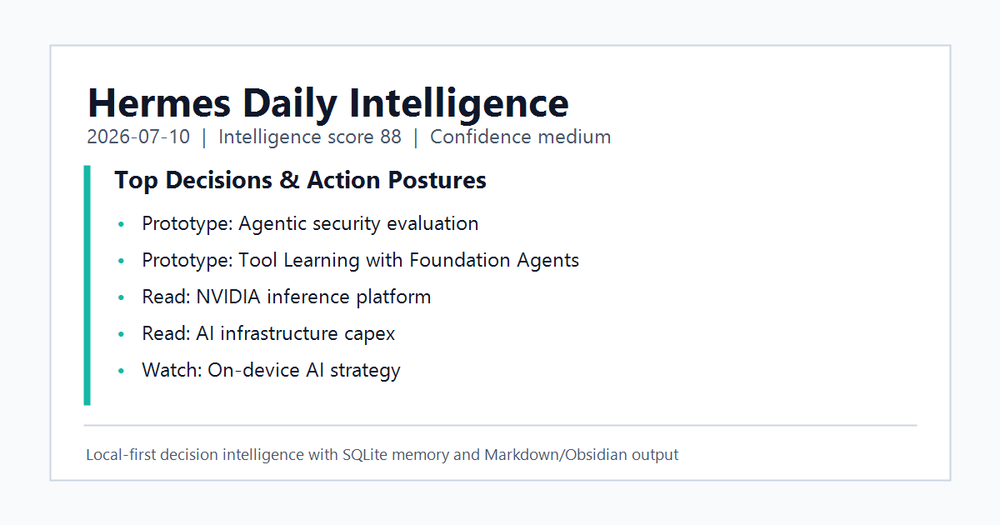
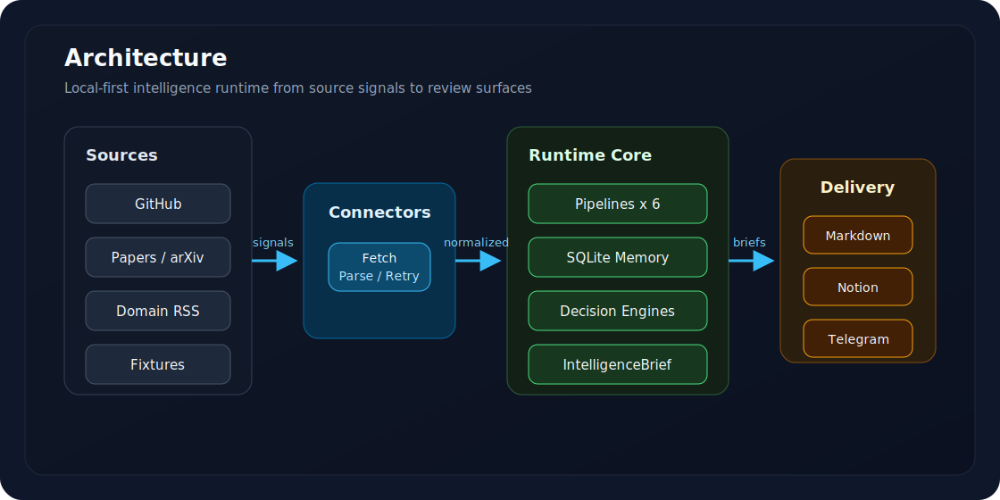
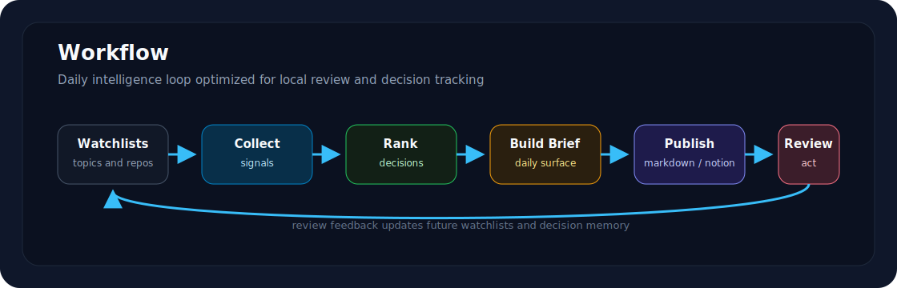

# Hermes Intelligence Platform

[English README](README.md)

Hermes 是一個 local-first 的決策情報系統。它把 GitHub repositories、論文、RSS 訊號整理成可行動的 Daily Brief，並用本機 SQLite 記住看過的 entity、decision 和歷史變化。

它不是一般的 AI 新聞摘要器。Hermes 的核心目標是把訊號轉成明確決策，例如 `Watch`、`Read`、`Prototype`、`Implement`、`Review later`，並讓這些決策可以被追蹤、回顧、累積。

## 為什麼不是 News Bot

- **決策優先**：重要訊號會被轉成 action，而不是只產生摘要。
- **本機記憶**：SQLite 記錄 repository、paper、ecosystem entity 和 decision history。
- **規則掌控 ranking**：`DecisionEngine` 與 deterministic scoring 負責排序與 action contract；LLM 可以輔助 rationale，但不默默覆蓋決策規則。
- **零 secret demo**：第一次使用不需要 API key、Notion、Telegram、GitHub token 或 cloud model。

## 30 秒 Demo

Windows PowerShell：

```powershell
python -m venv hub_env
.\hub_env\Scripts\python.exe -m pip install -r requirements.txt
.\hub_env\Scripts\python.exe -m hermes demo --date 2026-07-10 --output examples/output/obsidian
```

預期輸出：

```text
Hermes Daily Intelligence - 2026-07-10
Markdown demo: published - ...\examples\output\obsidian\DailyBriefs\Daily Brief - 2026-07-10.md
```

這個 demo 使用 repo 內建 fixtures，輸出 Markdown/Obsidian 檔案，不會呼叫外部 API。

## 範例輸出

可以先看已提交的範例：



- [Daily Brief](examples/samples/DailyBriefs/Daily%20Brief%20-%202026-07-10.md)
- [Repository page](examples/samples/Repositories/openai-openai-agents-python.md)
- [Paper page](examples/samples/Papers/Tool%20Learning%20with%20Foundation%20Agents.md)
- [Ecosystem page](examples/samples/Ecosystem/Agentic%20security%20evaluation.md)

## 架構



Hermes 的主線是：

1. 從 GitHub、arXiv/papers、domain RSS 或 fixtures 收集訊號。
2. Connectors 負責 fetch、parse、retry。
3. Runtime core 執行 pipelines、更新 SQLite memory、產生 decision ranking。
4. 最後輸出成 Markdown/Obsidian，也可以在 production 中接 Notion 或 Telegram。

## 工作流程



典型流程：

1. 維護 watchlists。
2. 收集技術訊號。
3. 排序 decision candidates。
4. 建立 Daily Brief。
5. 發布到 review surface。
6. 根據 review 結果回饋下一輪 watchlists 與 memory。

## 系統需求

- Python 3.11+
- Fixture demo 不需要 API key
- Production 或 live checks 才需要 GitHub、Notion、Telegram、cloud LLM 等 credentials

## 安裝

Windows PowerShell：

```powershell
python -m venv hub_env
.\hub_env\Scripts\Activate.ps1
python -m pip install -r requirements.txt
Copy-Item .env.example .env
```

Linux/macOS：

```bash
python3 -m venv hub_env
source hub_env/bin/activate
pip install -r requirements.txt
cp .env.example .env
```

## 快速啟動

Windows：

```powershell
.\hub_env\Scripts\python.exe -m hermes demo --date 2026-07-10 --output examples/output/obsidian
.\hub_env\Scripts\python.exe scripts\first_run_check.py
```

Linux/macOS：

```bash
python -m hermes demo --date 2026-07-10 --output examples/output/obsidian
python scripts/first_run_check.py
```

進階驗證：

```powershell
.\hub_env\Scripts\python.exe -m hermes doctor
.\hub_env\Scripts\python.exe -m hermes doctor --profile demo
.\hub_env\Scripts\python.exe scripts\acceptance_check.py
.\hub_env\Scripts\python.exe -m pytest tests -q
```

`main.py` 保留給 production orchestration；公開 first-run 路徑請使用 `python -m hermes demo`。

## 可選整合

- **Cloud LLM**：設定 `HERMES_CLOUD_*`、`HERMES_FAST_MODEL`、`HERMES_PRO_MODEL`、`HERMES_SYNTHESIS_MODE`。
- **GitHub live fetching**：設定 `GITHUB_TOKEN` 或 `GH_TOKEN` 以提高 API limit。
- **Notion**：設定 `NOTION_*`，用於 production review workspace。
- **Telegram**：設定 `TELEGRAM_*`，用於 production notifications。
- **Obsidian**：設定 `OBSIDIAN_ENABLED` 與 `OBSIDIAN_VAULT_PATH`，輸出到本機 vault。

完整設定請看 [docs/CONFIGURATION.md](docs/CONFIGURATION.md)。

## 文件索引

建議先看：

- [Architecture](docs/ARCHITECTURE.md)
- [Configuration](docs/CONFIGURATION.md)
- [Runbook](docs/RUNBOOK.md)
- [Roadmap](docs/ROADMAP.md)
- [Implementation Status](docs/IMPLEMENTATION_STATUS.md)

支援文件：

- [Troubleshooting](docs/TROUBLESHOOTING.md)
- [Release Checklist](docs/RELEASE.md)

完整文件索引在 [docs/README.md](docs/README.md)。

## 目前邊界

Phase 3 的重點是 release readiness：乾淨的 first-run demo、公開文件、CI coverage、sample output、發布安全檢查。

以下項目目前刻意延後，不屬於 Phase 3：

- Native dashboard UI
- Vector DB / semantic entity linking
- Semantic interest filtering
- Finance、cybersecurity、Apple、NVIDIA、startup 等專用 live APIs

## 貢獻

貢獻時請維持 zero-secret fixture demo 和 deterministic fallback path 可用。詳見 [CONTRIBUTING.md](CONTRIBUTING.md)。

## 授權與致謝

Hermes Intelligence Platform 使用 MIT License。詳見 [LICENSE](LICENSE)。

概念設計參考：

- [AI-News-Briefing](https://github.com/hoangsonww/AI-News-Briefing)：multi-model fallback、quality evaluation、Obsidian-oriented brief output。
- [ArxivDigest](https://github.com/AutoLLM/ArxivDigest)：research-interest filtering、scheduled research digest。
