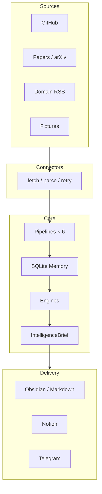
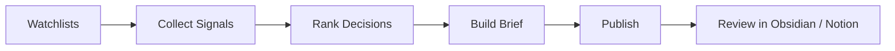

# Hermes Intelligence Platform — Phase 3 實作計畫

> **版本**: 1.0 · **日期**: 2026-07-12 · **目標階段**: Release Readiness（公開發布前的最後一個主要開發階段）  
> **基於**: Phase 2 完成後的 Release Readiness Review、程式碼與文件全面掃描

---

## 階段定位

Phase 1 已交付可運行的 end-to-end intelligence loop。Phase 2 已建立平台契約：`IntelligenceBrief`、`DecisionEngine`、`SynthesisPolicy`、`AgentRegistry`、零 secret demo 路徑，以及 178 項自動化測試。

Phase 3 的核心命題：

> **不是再加功能，而是讓 Hermes 成為一個定位清楚、架構可維護、新使用者能安裝成功、5 分鐘內可體驗核心價值、文件不誤導、無需作者口頭解釋即可使用的 GitHub 公開專案。**

Phase 3 完成後，原則上不再進行大規模架構重做或持續擴充核心範圍，只進行 Bug 修正、文件補充、使用體驗改善、小型功能迭代，以及根據實際回饋調整。

### 誠實評估

專案**技術內核已具備公開條件**（demo 可跑、測試通過、架構邊界清楚）。**現狀尚不適合直接 push GitHub**——缺的是發布工程（LICENSE、git、secret audit、訪客向 README、可見 sample output）與定位一致性。Phase 3 全部完成後可以公開。

### 已確認的 Phase 3 方向

| 決策 | 選擇 |
|------|------|
| 首要目標 | Release Readiness，非功能擴充 |
| 開源 primary demo | Markdown/Obsidian，零 API key |
| Production 路徑 | Notion + Telegram + cloud LLM + Windows 排程（作者自用，標為 optional） |
| 公開敘事 | Obsidian-first open source / Notion-optional production |
| 未實作 PRD 功能 | 標記 deferred，不在 Phase 3 實作 |
| 架構 | 不做大規模重寫 |
| 全部工作項 | 本計畫所列項目均為必須完成 |

---

## 現況摘要（掃描結論）

### 專案解決的問題

Hermes 把外部技術訊號（GitHub、論文、RSS）壓縮成**可執行的決策情報**，而非新聞摘要。核心輸出是帶 action（Ignore / Watch / Read / Prototype / Implement / Review later）、confidence、rationale 的 `IntelligenceBrief`，並以 SQLite 記憶實體演進。

### 架構邊界（Phase 2 已建立）

```text
Sources → Connectors → Pipelines × 6 → SQLite Memory
  → Engines (Intelligence / Decision / Synthesis / Memory)
  → IntelligenceBrief → Delivery (Obsidian / Notion / Telegram)
```

### 公開前的關鍵缺口

1. 無 git repository、無根目錄 LICENSE
2. README 面向維護者，10 秒內無法傳達價值
3. `examples/output/` 被 gitignore，clone 後看不到成果
4. 文件定位矛盾（Obsidian-first vs Notion-first）
5. PRD §2.8 語意過濾在 config 存在但未接入 pipeline
6. Quick Start 入口混亂（`main.py` vs `hermes demo`）
7. CI 未覆蓋 demo / acceptance / first-run 路徑

### 最可能影響公開品質的五個問題

1. GitHub 首頁 30 秒內無法理解價值
2. 文件定位互相矛盾，使用者誤以為必須有 Notion
3. PRD 承諾與程式碼現實有落差（`interest_profile` / `relevance_threshold` 未使用）
4. Quick Start 入口混亂
5. Repository 缺乏開源法律與安全基礎

---

## Phase 3 驗收標準（完成定義）

Phase 3 視為完成，需同時滿足：

1. **法律與安全**：根目錄 MIT LICENSE；secret audit 零命中；`.gitignore` 完整
2. **First-run**：陌生開發者依 README 三條命令、5 分鐘內看到 Intelligence Brief 輸出
3. **定位一致**：所有公開面向文件統一 Obsidian-first / Notion-optional 敘事
4. **誠實邊界**：未實作功能（語意過濾、native UI、專用 domain API）明確標 deferred
5. **自動化**：CI（Windows + Linux）通過 pytest、compileall、smoke、demo、acceptance、first_run
6. **可見成果**：`examples/samples/` 含可瀏覽的 sample output
7. **貢獻面**：CONTRIBUTING、Issue/PR templates、SECURITY.md、CHANGELOG + v0.1.0 tag
8. **不引入 scope creep**：無新 pipeline、無 native UI、無語意過濾實作

---

## 工作項目

以下所有項目均為**必須完成**。每項包含：為什麼、解決什麼、預期成果、驗收方式、涉及檔案。

---

### 1. 初始化 Git Repository 並建立發布前 Secret Audit

| 欄位 | 內容 |
|------|------|
| **為什麼** | 無 git 無法 push；需防止 API key、memory、logs 進 repo |
| **解決什麼** | 法律與安全基礎缺失 |
| **預期成果** | 乾淨的 initial commit；pre-publish 掃描腳本 |
| **驗收方式** | `git status` 不顯示 `.env`、`hub_env/`、`logs/`、`data/*.sqlite`、`exports/`；`scripts/pre_publish_audit.py` exit 0 |
| **涉及檔案** | 根目錄、`.gitignore`、`scripts/pre_publish_audit.py` |

**具體工作：**

- 初始化 git repository，建立 initial commit
- 確認 `.gitignore` 覆蓋：`hub_env/`、`.env`、`logs/`、`exports/`、`data/*.sqlite`、`examples/output/`、`tests/.capability*/`、`__pycache__/`
- 新增 `scripts/pre_publish_audit.py`：掃描常見 token pattern（API key、Notion token、Telegram token、private key 等），命中則 exit 1
- 發布前人工確認工作區無 production memory 或含 secret 的 log

---

### 2. 新增根目錄 MIT LICENSE

| 欄位 | 內容 |
|------|------|
| **為什麼** | 開源必要條件；`docs/LICENSE_COMPLIANCE.md` 已建議 MIT |
| **解決什麼** | 他人無法合法使用/貢獻 |
| **預期成果** | 根目錄 `LICENSE`；README Acknowledgements 區塊 |
| **驗收方式** | GitHub 自動識別 license；與參考專案 MIT 相容 |
| **涉及檔案** | `LICENSE`、`README.md`、`docs/LICENSE_COMPLIANCE.md` |

**具體工作：**

- 在根目錄新增 MIT LICENSE（含 copyright 年份與持有者）
- 更新 `docs/LICENSE_COMPLIANCE.md` checklist，標記 LICENSE 已完成
- 在 README 底部加入 Acknowledgements：AI-News-Briefing、ArxivDigest 概念致謝

---

### 3. 重寫 README 為訪客優先結構

| 欄位 | 內容 |
|------|------|
| **為什麼** | GitHub 首頁是唯一行銷面；現 README 面向維護者 |
| **解決什麼** | 10 秒/30 秒/5 分鐘理解問題 |
| **預期成果** | 訪客優先 README |
| **驗收方式** | 非作者使用者僅依 README 完成 demo；不再以 `main.py --topic` 作為主入口 |
| **涉及檔案** | `README.md` |

**具體工作：**

README 必須包含以下區塊（順序建議如下）：

1. **一句話定位**：「Local-first 決策情報系統：把 GitHub、論文、RSS 變成帶記憶的行動簡報，而不是另一個 AI 新聞摘要。」
2. **為什麼不是 News Bot**（3 點：Decision actions / SQLite memory / Rule-owned ranking）
3. **30 秒 Demo**（3 條命令 + 預期輸出路徑）
4. **範例輸出**（連結 `examples/samples/`）
5. **架構一圖**（mermaid）
6. **執行流程一圖**（mermaid：Sources → Engines → Brief → Publishers）
7. **環境需求**（Python 3.11+）
8. **安裝**
9. **Quick Start（零 API key）**
10. **可選整合**（Notion / Telegram / Cloud LLM，明確標 optional）
11. **文件導覽**（只連 5 份必要文件，其餘指向 `docs/README.md`）
12. **Roadmap 摘要**（連結 `docs/ROADMAP.md`）
13. **Contributing**（連結 `CONTRIBUTING.md`）
14. **License & Acknowledgements**

---

### 4. 提交靜態 Sample Output

| 欄位 | 內容 |
|------|------|
| **為什麼** | `examples/output/` 被 ignore，clone 後零視覺成果 |
| **解決什麼** | GitHub 訪客無法在跑 demo 前看到價值 |
| **預期成果** | `examples/samples/` 可瀏覽 |
| **驗收方式** | repo 內可直接閱讀 sample markdown；README 連結有效 |
| **涉及檔案** | `examples/samples/`、`.gitignore`、`examples/README.md` |

**具體工作：**

- 新增 `examples/samples/`（**不受 gitignore**）
- 從 `python -m hermes demo` 產出中挑選並提交：
  - 1 份 Daily Brief（精簡版或完整版）
  - 2–3 份 Repository / Paper / Ecosystem 頁面
- 更新 `examples/README.md`：說明 samples 是靜態展示，如何 regenerate 到 `examples/output/`

---

### 5. 統一公開定位敘事

| 欄位 | 內容 |
|------|------|
| **為什麼** | 多份文件對「主 workspace」描述衝突 |
| **解決什麼** | 使用者誤以為必須有 Notion |
| **預期成果** | 公開敘事一致 |
| **驗收方式** | 交叉檢查以下文件，Obsidian-first / Notion-optional 表述一致 |
| **涉及檔案** | `docs/README.md`、`docs/PRODUCT_DEFINITION.md`、`docs/PRD.md`、`docs/ARCHITECTURE.md` |

**統一敘事：**

- **開源 / demo 路徑**：Markdown/Obsidian，零 secret
- **Production 路徑（作者自用）**：Notion + Telegram + cloud LLM + Windows 排程
- **兩者共用**：同一 `IntelligenceBrief` 契約與 SQLite memory

**具體工作：**

- 更新 `docs/README.md` 開頭：不再寫「Notion 是 v1 主 workspace」作為唯一表述
- 更新 `docs/PRODUCT_DEFINITION.md`：加入 Public vs Production 區分
- 在 `docs/PRD.md` 加「Public Demo vs Production Deployment」小節（不重寫 PRD）
- 確認 `docs/ARCHITECTURE.md` Publishers 段落與 ADR 0003 一致

---

### 6. 修正 Quick Start 入口與 CLI 指引

| 欄位 | 內容 |
|------|------|
| **為什麼** | `main.py` 實際是 orchestration 入口，README 仍引導 research brief 路徑 |
| **解決什麼** | 第一次執行困惑或踩錯入口 |
| **預期成果** | 公開文件 Quick Start 一致 |
| **驗收方式** | README、CONTRIBUTING、RUNBOOK 的 Quick Start 段落一致；`main.py` 標為 production orchestration |
| **涉及檔案** | `README.md`、`CONTRIBUTING.md`、`docs/RUNBOOK.md` |

**公開 Quick Start 標準路徑：**

```powershell
python -m venv hub_env
pip install -r requirements.txt
python -m hermes demo --date 2026-07-10 --output examples/output/obsidian
```

進階驗證：

```powershell
python -m hermes doctor
python scripts/acceptance_check.py
python -m pytest tests -q
```

---

### 7. 標記未實作 PRD 功能，避免誤導

| 欄位 | 內容 |
|------|------|
| **為什麼** | `interest_profile` / `relevance_threshold` 在 config 存在但未接入 pipeline |
| **解決什麼** | 文件過度承諾、可信度受損 |
| **預期成果** | 誠實邊界 |
| **驗收方式** | 新使用者不會以為語意過濾已可用 |
| **涉及檔案** | `docs/ROADMAP.md`、`docs/PRD.md`、`docs/IMPLEMENTATION_STATUS.md`、`.env.example` |

**具體工作：**

- `docs/ROADMAP.md` 新增 **Deferred: Semantic Interest Filtering**（含 PRD §2.8 對照）
- `docs/PRD.md` §2.8 加 status 標記：`Deferred — config keys exist, pipeline not wired`
- `docs/IMPLEMENTATION_STATUS.md` 的 Not Yet Implemented 加入語意過濾
- `.env.example`：不暴露 `HERMES_INTEREST_PROFILE` / `HERMES_RELEVANCE_THRESHOLD`，或在註解標 `# PLANNED — not wired yet`

---

### 8. 乾淨環境 First-Run 驗證腳本

| 欄位 | 內容 |
|------|------|
| **為什麼** | 作者環境有完整 `.env`，新使用者可能不同 |
| **解決什麼** | 「在我機器上可以」問題 |
| **預期成果** | 可自動驗證的 first-run 路徑 |
| **驗收方式** | 僅用 `.env.example` 副本（空 API key）可跑通 demo 並產出 markdown 檔 |
| **涉及檔案** | `scripts/first_run_check.py` |

**具體工作：**

- 新增 `scripts/first_run_check.py`：
  - 在 isolated temp 目錄建立 venv 或直接用當前 python
  - 複製 `.env.example` 為 `.env`（不填 secret）
  - 執行 `python -m hermes demo --date 2026-07-10 --output <temp>/obsidian`
  - 断言 Daily Brief markdown 檔存在且非空
  - exit 0 / 1

---

### 9. 擴充 CI：demo + acceptance + first_run

| 欄位 | 內容 |
|------|------|
| **為什麼** | 現 CI 未覆蓋核心公開路徑 |
| **解決什麼** | demo 路徑回歸無人知 |
| **預期成果** | CI 覆蓋完整公開驗證鏈 |
| **驗收方式** | Windows + Linux CI 綠燈，包含以下全部步驟 |
| **涉及檔案** | `.github/workflows/ci.yml` |

**CI 必須包含：**

```yaml
- python -m pytest tests -q
- python -m compileall contracts core connectors hermes workflows scripts main.py
- python scripts/smoke_test.py
- python scripts/acceptance_check.py
- python -m hermes demo --date 2026-07-10 --output examples/output/obsidian
- python scripts/first_run_check.py
```

---

### 10. 完善 `.env.example` 與設定分層文件

| 欄位 | 內容 |
|------|------|
| **為什麼** | 缺少 synthesis 相關變數；optional vs required 不清 |
| **解決什麼** | 設定誤解 |
| **預期成果** | 完整且分層的設定文件 |
| **驗收方式** | 依 `docs/CONFIGURATION.md` 可完成 cloud 或 Notion 可選設定 |
| **涉及檔案** | `.env.example`、`docs/CONFIGURATION.md` |

**`.env.example` 必須分三段註解：**

1. **Demo 路徑（無需填寫）**：memory、fixture、watchlist 路徑
2. **Optional — Cloud LLM**：`HERMES_CLOUD_*`、`HERMES_SYNTHESIS_MODE`、`HERMES_PRO_CALL_LIMIT`
3. **Optional — Integrations**：GitHub、Notion、Obsidian、Telegram

**新增 `docs/CONFIGURATION.md` 一頁，包含：**

- 各環境變數說明與預設值
- Demo / Production / Live-check 三種 profile 的最小設定集
- 常見 migration alias（`GH_TOKEN`、`DEEPSEEK_*` 等）

---

### 11. README 架構圖與執行流程圖

| 欄位 | 內容 |
|------|------|
| **為什麼** | 降低首次理解成本 |
| **解決什麼** | 外人以為是 pipeline 集合而非情報平台 |
| **預期成果** | README 含兩張 mermaid 圖 |
| **驗收方式** | GitHub 上 mermaid 可渲染 |
| **涉及檔案** | `README.md` |

**架構圖（模組邊界）：**



**流程圖（使用者視角）：**



---

### 12. Daily Brief 截圖與 Social Preview

| 欄位 | 內容 |
|------|------|
| **為什麼** | 視覺 hook 提升 GitHub 首屏理解 |
| **解決什麼** | 純文字 README 吸引力不足 |
| **預期成果** | `docs/assets/` 含 brief 截圖；README 嵌入 |
| **驗收方式** | README 顯示 preview 圖；可選設定 GitHub social preview |
| **涉及檔案** | `docs/assets/daily-brief-preview.png`、`README.md` |

**具體工作：**

- 從 `examples/samples/` 的 Daily Brief 擷取或渲染截圖
- 放入 `docs/assets/daily-brief-preview.png`
- README「範例輸出」區塊嵌入該圖

---

### 13. Troubleshooting 與 FAQ

| 欄位 | 內容 |
|------|------|
| **為什麼** | 減少公開後 Issue 噪音 |
| **解決什麼** | 常見失敗無文件可查 |
| **預期成果** | 獨立 troubleshooting 文件 |
| **驗收方式** | 覆蓋以下 top 場景 |
| **涉及檔案** | `docs/TROUBLESHOOTING.md`、`README.md`（連結） |

**必須覆蓋的場景：**

1. `hermes demo` 失敗（fixture 缺失、Python 版本、路徑）
2. 誤以為需要 Notion / cloud API key 才能跑 demo
3. `main.py` 與 `hermes demo` 差異
4. Windows vs Linux 命令差異
5. `HERMES_MEMORY_DB` 與 production memory 保護
6. `--model-synthesis` 與 deterministic fallback
7. Notion provisioning 常見錯誤
8. GitHub rate limit（無 token）
9. doctor 顯示大量 skipped 的解讀
10. CI 本地重現方式

---

### 14. GitHub Issue 與 Pull Request Templates

| 欄位 | 內容 |
|------|------|
| **為什麼** | 提升貢獻品質、減少不完整 Issue |
| **解決什麼** | 公開後 Issue/PR 格式混亂 |
| **預期成果** | 標準模板 |
| **驗收方式** | `.github/ISSUE_TEMPLATE/` 與 `pull_request_template.md` 存在且可用 |
| **涉及檔案** | `.github/ISSUE_TEMPLATE/bug_report.md`、`.github/ISSUE_TEMPLATE/feature_request.md`、`.github/pull_request_template.md` |

**Issue template 必須引導：**

- Bug：重現步驟、環境（OS/Python）、是否使用 demo 或 production 路徑
- Feature：是否符合 Phase 3 後「不做大擴充」原則

**PR template 必須包含：**

- 變更摘要
- 測試命令與結果
- 是否影響 fixture demo 路徑
- 是否更新文件

---

### 15. SECURITY.md

| 欄位 | 內容 |
|------|------|
| **為什麼** | 負責任披露、GitHub Security tab |
| **解決什麼** | 安全問題無通報管道 |
| **預期成果** | 根目錄或 `.github/SECURITY.md` |
| **驗收方式** | 文件說明如何通報、哪些屬於 out of scope |
| **涉及檔案** | `.github/SECURITY.md` 或 `SECURITY.md` |

**必須包含：**

- 通報方式（GitHub Security Advisory 或 email placeholder）
- 強調 `.env`、token 不可提交
- Out of scope：使用者自行洩漏的 API key

---

### 16. CHANGELOG 與 v0.1.0 Release Tag

| 欄位 | 內容 |
|------|------|
| **為什麼** | 版本錨點、首次發布可追溯 |
| **解決什麼** | 無 release 起點 |
| **預期成果** | `CHANGELOG.md` + git tag `v0.1.0` |
| **驗收方式** | tag 指向 Phase 3 完成 commit；CHANGELOG 含 v0.1.0 條目 |
| **涉及檔案** | `CHANGELOG.md` |

**v0.1.0 條目必須摘要：**

- Phase 1/2 核心能力
- 零 secret demo 路徑
- Phase 3 release readiness 交付物

---

### 17. Doctor Demo Profile

| 欄位 | 內容 |
|------|------|
| **為什麼** | 新使用者跑 doctor 看到大量 skipped 可能以為設定錯誤 |
| **解決什麼** | 零 secret 路徑的 readiness 表述不清 |
| **預期成果** | `hermes doctor --profile demo` 只檢查 demo 相關項目 |
| **驗收方式** | demo profile 下無 cloud/notion/telegram failed；文件說明 profile 差異 |
| **涉及檔案** | `hermes/__main__.py`、`core/doctor.py`、`docs/RUNBOOK.md`、`docs/CONFIGURATION.md` |

**demo profile 檢查範圍：**

- project_root、fixture_root、watchlists、fixtures 存在
- synthesis_policy 合法
- 可選整合顯示 skipped（不算 failed）
- 不 require cloud_api_key

---

### 18. Linux Quick Start 文件

| 欄位 | 內容 |
|------|------|
| **為什麼** | 23 個 PowerShell script 給人 Windows-only 印象 |
| **解決什麼** | Linux 使用者無明確入口 |
| **預期成果** | bash 版 Quick Start |
| **驗收方式** | Ubuntu CI 與文件命令一致；Linux 可跑通 demo |
| **涉及檔案** | `README.md`、`docs/RUNBOOK.md` |

**bash Quick Start 範例：**

```bash
python3 -m venv hub_env
source hub_env/bin/activate
pip install -r requirements.txt
python -m hermes demo --date 2026-07-10 --output examples/output/obsidian
```

---

### 19. GitHub Repository Metadata

| 欄位 | 內容 |
|------|------|
| **為什麼** | 可發現性與首屏資訊 |
| **解決什麼** | Topics / description 空白 |
| **預期成果** | 發布清單中的 metadata 建議 |
| **驗收方式** | 公開 repo 設定完成 |
| **涉及檔案** | `docs/RELEASE.md`（發布操作清單） |

**建議設定：**

- **Description**: Local-first decision intelligence: turn GitHub, papers, and RSS into actionable briefs with memory.
- **Topics**: `decision-intelligence`, `local-first`, `obsidian`, `github-radar`, `arxiv`, `sqlite`, `python`, `intelligence-platform`
- **Website**: 留空或指向 docs
- **Social preview**: 使用 `docs/assets/daily-brief-preview.png`

---

### 20. 精簡公開文件索引

| 欄位 | 內容 |
|------|------|
| **為什麼** | `docs/` 20+ 份文件對新人過重 |
| **解決什麼** | 不知從哪讀起 |
| **預期成果** | README 只突出 5 份必要文件 |
| **驗收方式** | 新使用者 15 分鐘內理解邊界，不需讀 PRD 全文 |
| **涉及檔案** | `README.md`、`docs/README.md` |

**公開必讀 5 份：**

1. `README.md`
2. `docs/ARCHITECTURE.md`
3. `docs/CONFIGURATION.md`
4. `docs/RUNBOOK.md`
5. `docs/ROADMAP.md`

其餘（PRD、NOTION_WORKSPACE、implementation_plan 等）標為「維護者 / 深度閱讀」。

---

### 21. 更新 IMPLEMENTATION_STATUS 與 ROADMAP

| 欄位 | 內容 |
|------|------|
| **為什麼** | Phase 3 完成後狀態需同步 |
| **解決什麼** | 文件與 reality drift |
| **預期成果** | 標記 Phase 2 完成、Phase 3 完成項 |
| **驗收方式** | IMPLEMENTATION_STATUS 含 Phase 3 全部交付物 |
| **涉及檔案** | `docs/IMPLEMENTATION_STATUS.md`、`docs/ROADMAP.md` |

**ROADMAP 更新：**

- Phase 2 Platform Contracts → **Completed**
- 新增 Phase 3 Release Readiness → **Completed**（完成後更新）
- 保留 v4 / v5 / semantic filtering 為 post-release

---

### 22. 發布操作清單（RELEASE.md）

| 欄位 | 內容 |
|------|------|
| **為什麼** | 可重複、可審核的發布流程 |
| **解決什麼** | 發布時遺漏步驟 |
| **預期成果** | 逐步發布 checklist |
| **驗收方式** | 依 RELEASE.md 可完成首次 public push |
| **涉及檔案** | `docs/RELEASE.md` |

**RELEASE.md 必須包含：**

1. 執行 `pre_publish_audit.py`
2. 本地跑通全部 CI 等價命令
3. 確認 samples 與 screenshots 已提交
4. `git push` + 設定 repo metadata
5. 建立 GitHub Release v0.1.0
6. 發布後 smoke：clone 到新目錄跑 demo

---

## 明確不做項目（Scope 控制）

以下項目 **不在 Phase 3 範圍內**，避免 scope creep：

| 項目 | 原因 |
|------|------|
| Native Executive Dashboard UI | ROADMAP deferred；不影響 demo |
| Vector DB / semantic entity linking | ADR 0002 明確排除 |
| 語意興趣過濾 pipeline 實作 | 標 deferred，非發布阻塞 |
| Finance/Cyber/Apple/NVIDIA/Startup 專用 API | 現 RSS 已足 demo |
| 新增 domain agents | 僅 `ai_intelligence` 已證明契約 |
| 大規模架構重寫 | Phase 2 邊界已足夠 |
| Multi-tenant / Web UI | 超出個人 intelligence platform 定位 |
| 行銷網站 / 宣傳影片 | sample + 截圖已足 |
| 將六 pipeline 合併或拆分 microservices | 過度工程 |

---

## 執行依賴順序

不含時程，僅表示前置依賴：

```text
(1) Git + LICENSE + Secret Audit
  → (2) Sample Output + First-Run Check
  → (3) README / 定位統一 / CONFIGURATION
  → (4) CI 擴充 + Doctor Demo Profile
  → (5) Troubleshooting + Templates + SECURITY + CHANGELOG
  → (6) IMPLEMENTATION_STATUS / ROADMAP / RELEASE.md 更新
  → (7) 依 Release Checklist 發布 + v0.1.0 tag
```

---

## 最終 Release Checklist

Phase 3 全部完成並公開前，逐項確認：

### 法律與安全

- [ ] 根目錄 `LICENSE`（MIT）
- [ ] `scripts/pre_publish_audit.py` exit 0
- [ ] `.gitignore` 完整
- [ ] README Acknowledgements

### 產品定位

- [ ] README 首段一句話 + 3 點差異
- [ ] Obsidian-first / Notion-optional 敘事一致（4 份文件交叉檢查）
- [ ] 未實作功能標 deferred（語意過濾、native UI、專用 domain API）

### 核心體驗

- [ ] 乾淨環境 `hermes demo` 5 分鐘內成功
- [ ] `examples/samples/` 可瀏覽
- [ ] README 不以 `main.py --topic` 為主入口
- [ ] Linux bash Quick Start 可跑通

### 可靠性與自動化

- [ ] `pytest` 全過
- [ ] `acceptance_check.py` 全過
- [ ] `first_run_check.py` 全過
- [ ] CI Windows + Linux 綠（含 demo + acceptance + first_run）
- [ ] `hermes doctor --profile demo` 行為符合文件

### 文件與貢獻

- [ ] `.env.example` + `docs/CONFIGURATION.md`
- [ ] `docs/TROUBLESHOOTING.md`
- [ ] Issue / PR templates
- [ ] `SECURITY.md`
- [ ] `CHANGELOG.md` + tag `v0.1.0`
- [ ] `docs/RELEASE.md`
- [ ] `docs/IMPLEMENTATION_STATUS.md` / `docs/ROADMAP.md` 已更新

### GitHub 品質

- [ ] Repo description + topics
- [ ] Social preview 圖
- [ ] 公開後 clone smoke 通過

### Scope 確認

- [ ] Phase 3 未引入新 pipeline、native UI、語意過濾實作

---

## 公開發布後微調方向

Phase 3 完成並公開後，依 Issue 回饋做小步調整（非 Phase 3 交付物）：

| 方向 | 動作 |
|------|------|
| 安裝/跑不起來 | 更新 Troubleshooting |
| Demo 輸出可讀性 | 小幅改善 Markdown renderer |
| Notion/cloud 整合 | 精簡 NOTION_WORKSPACE 公開 quick path |
| Telegram | 完成 live E2E 並更新 IMPLEMENTATION_STATUS |
| 貢獻者 onboarding | 標記 good first issue |
| Roadmap 校準 | 依回饋調整 v4 優先序 |

**持續不做：** native UI、vector DB、multi-domain 專用 API、語意過濾（除非另開 Phase 4 決策）。

---

## 附錄：產品定位速查

**一句話：** Local-first 決策情報系統——把 GitHub、論文、RSS 變成帶記憶的行動簡報。

**目標使用者：** 技術決策者、AI/infra 工程師、個人 intelligence workflow 使用者。

**與現有工具差異：**

| 類型 | 差異 |
|------|------|
| News summarizer | Hermes 產出 decision action，不是摘要 |
| RSS reader | Hermes 有 memory、cross-signal、revisit |
| Notion template | Hermes 是 runtime + automation，Notion 只是 optional publisher |
| Generic agent demo | Action 由規則引擎決定，LLM 只輔助 rationale |

**公開核心亮點：** Decision intelligence with memory, not news summaries.

**第一次體驗必看：** Daily Intelligence Brief 的 Top Decisions + action rationale + cross-signal 段落。
