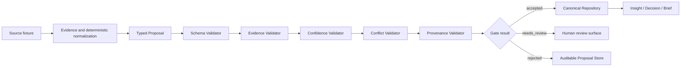

# Proposal Trust Layer

The Proposal Trust Layer prevents non-deterministic model, agent, and extraction output from directly becoming canonical knowledge.

This walkthrough uses the real zero-secret seed implemented in `core/release_runtime.py` and exercised by `tests/test_proposal_trust_layer.py` and `tests/test_release_candidate.py`.

## Lifecycle



## 1. Evidence Comes First

The demo loads connected GitHub, paper, and domain fixtures from `data/fixtures/`. Deterministic collection creates source-backed observations and relationships before the Insight Engine proposes cross-signal conclusions.

One accepted demo insight connects the paper fixture **Agentic Retrieval for Code Editing** with the domain fixture **Agentic security evaluation**. Its proposal includes:

- `proposal_type=insight`
- `proposed_by=intelligence_hub.insight_engine`
- multiple observation, relationship, and decision evidence references
- related entity references
- `confidence=medium`
- a possible `Prototype` action

The generated UUIDs are intentionally not copied into this document; read them from the current seeded repository.

## 2. Typed Proposals

`Proposal` contains typed payloads plus:

- evidence references
- confidence
- proposed-by identity
- model and prompt metadata when applicable
- validation status
- rejection reasons
- conflict references
- accepted canonical ID

The gate composes schema, evidence, confidence, conflict, and provenance validators. A passing validator does not directly write SQLite; canonical persistence happens only after the combined gate result is accepted.

## 3. Rejected Example

The seed creates this real demonstration proposal:

```text
type: insight
claim: Unsupported demo claim should be rejected.
summary: This proposal intentionally has no evidence.
proposed_by: intelligence_hub.demo_seed
confidence: medium
evidence_refs: []
result: rejected
reason: missing evidence_refs
```

It remains queryable in the Proposal Store and appears in the Dashboard review surface and `90 System/Rejected Proposals.md`. It does not create a canonical Insight.

## 4. Needs-Review Example

The seed also creates:

```text
type: entity
canonical_name: Local-first AI operations
proposed_by: intelligence_hub.demo_seed
confidence: low
evidence_refs: [demo:review-surface]
result: needs_review
reason: low confidence
```

This record has evidence and provenance, so it is not rejected for missing fundamentals. Its low confidence requires human review.

Human acceptance reruns the non-bypassable schema, evidence, and provenance checks. It cannot turn an invalid proposal into canonical knowledge merely by changing a status field.

## 5. Status Meanings

| Status | Meaning | Canonical write |
| --- | --- | --- |
| `accepted` | Required validators pass and no unresolved review condition remains. | Allowed through the canonical persistence service. |
| `needs_review` | The proposal is structurally valid but uncertainty or conflict requires a person. | Not yet allowed. |
| `rejected` | Required evidence, schema, provenance, or policy conditions fail. | Never allowed. |

## Reproduce It

```bash
intelligence-hub seed-demo
intelligence-hub proposals --status rejected
intelligence-hub proposals --status needs_review
intelligence-hub proposals --status accepted
```

The seed is idempotent. Repeating `intelligence-hub seed-demo` does not duplicate accepted canonical records.

To review a current proposal ID:

```bash
intelligence-hub review-proposal <proposal-id> --action revalidate
intelligence-hub review-proposal <proposal-id> --action accept
intelligence-hub review-proposal <proposal-id> --action reject --reason "review notes"
```

## API and Dashboard

Relevant API routes:

- `GET /api/proposals`
- `GET /api/proposals/{id}`
- `POST /api/proposals/{id}/revalidate`
- `POST /api/proposals/{id}/accept`
- `POST /api/proposals/{id}/reject`

The Dashboard **Proposal Review** page shows evidence, confidence, provenance, status, and rejection reasons. Review actions call the same platform service used by the CLI.

## Current Limits

The Proposal Trust Layer is a validation and provenance boundary, not a universal fact-checking system.

- Evidence references prove traceability to stored records; they do not guarantee that an external source is true.
- Conflict detection is rule-based and intentionally sends ambiguous cases to review.
- Confidence thresholds are policy signals, not calibrated probabilities.
- The system does not yet provide causal reasoning, multi-agent debate, or automated high-risk conflict acceptance.
- Optional agents, including Hermes, must submit proposals through this boundary.
